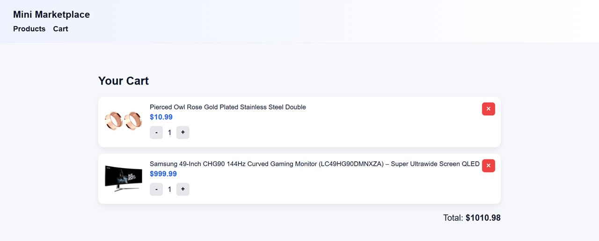

• Ism: Topilov Asilbek  
• Vazifa qancha vaqt oldi: 1 soat  
• Qiyin bo‘lgan joylar:  
Juda oson, lekin katta ehtimol bilan bu topshiriq rus tilidan yoki biror tildan 'translator' yordamida tarjima qilib qo'yilgan. Jumalalar, so'zlar noodatiy, tushunishga qiyinroq. Minimal stillar bilan react'da bajarildi, loyiha juda kichik bo'lgani uchun ko'p component'larga ajratilmadi. Bir joyi tushunarsiz bo'ldi: ma'lumotlarni olish reactsiz deb yozilibdi, lekin React funksionalligi alohida zona deb yozilibdi. Nima nazarda tutilganini tushunolmadim. Agar react ishlatmasdan, Pure js'da yozish kerak bo'lgan bo'lsa, u ham muammo emas edi albatta. Faqat o'zbek tilida bu tarzda yozilgani tushunishga biroz qiyinlik qildi))
• Interfeys skrinshotlari:  
  
  
• Demo havolasi: https://market.topilov.uz/